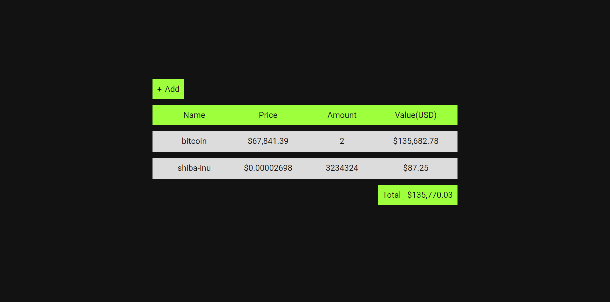

# Crypto Tracker

## This is a simple web based cryptocurrency tracker

### Description

In this Web application you can add the cryptocurrencies you have with the amount that you have of each of them so that you can keep track of them over time. This application is built using HTML,CSS and pure JS. It uses the browser's localstorage API to store the infromation about the cryptocurrencies that the user adds. I used [CoinCap](https://docs.coincap.io/) API to get cryptocurrencies information. You can add any of the 1000 first cryptocurrencies in CoinCap rank.
I built this application to practice my JS skills.

### How the app looks



### Tech stack

- HTML
- CSS
- JavaScript

### How to access the app

- You can easily access on [Live Server](https://ahmadmohammadirad2006.github.io/crypto-tracker/)

- Or you can download it

```
git clone https://github.com/ahmadmohammadirad2006/crypto-tracker.git
```
Go the directory
```
cd crypto-tracker
```

And then run it

```
index.html
```
